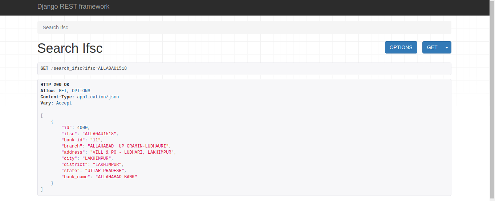
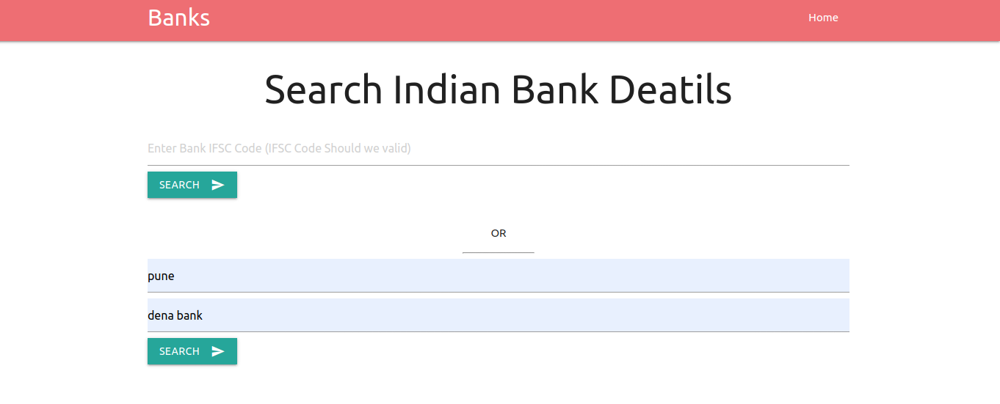
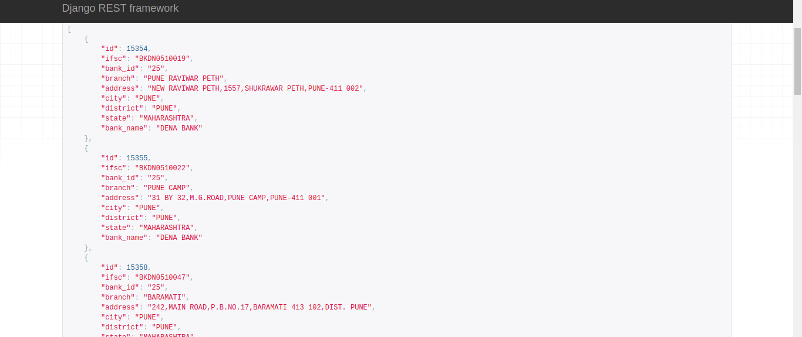
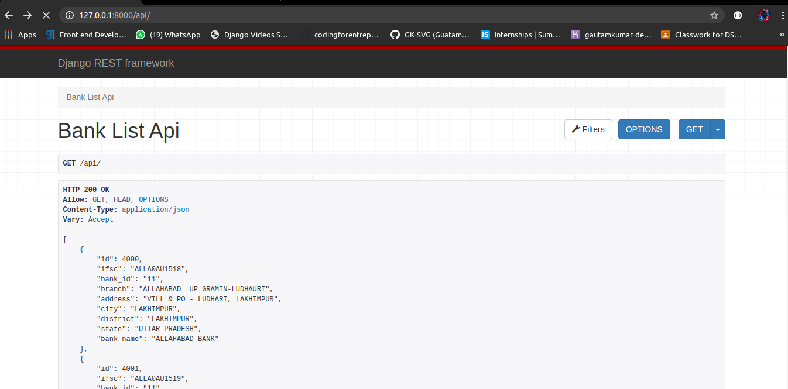
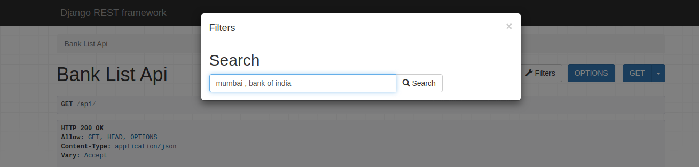
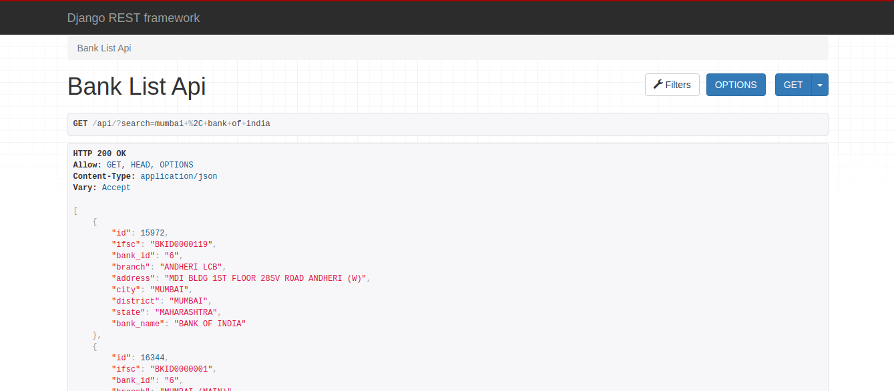

<h2>Indian Banks API</h2> 

<b>Search banks by IFSC Code</b>

<b>Search Results of Ifsc Code</b>

<b>Search banks by City and Bank-name</b>

<b>Search Results</b>

<b>You can directly see the list of all Banks in india</b>

<b>You can Here also Search banks by IFSC code or City and Bank-name</b>

<b>Search Results</b>

