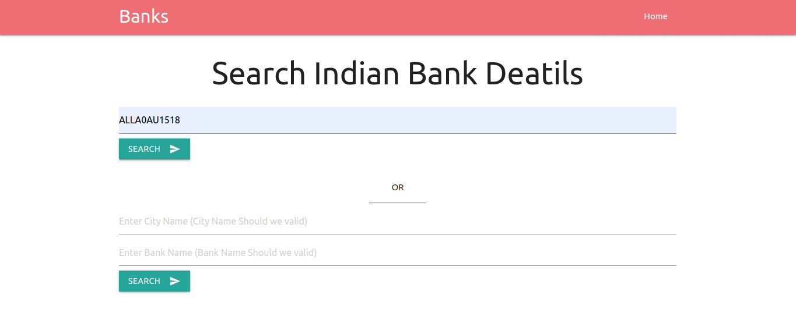

<h2>Indian Banks API</h2> 

Here you can get data of any bank in india by query IFSC Code Or City and Bank Name
  
<a href="https://indianbankslist.herokuapp.com">Click me for Go on Live Site</a>   

<h2>Here is some screenshot of live site</h2>

<b>Search banks by IFSC Code</b>

<b>Search Results of Ifsc Code</b>

<b>Search banks by City and Bank-name</b>

<b>Search Results</b>

<b>You can directly see the list of all Banks in india on /api/ url</b>

<b>You can Here also Search banks by IFSC code or City and Bank-name</b>

<b>Search Results</b>

